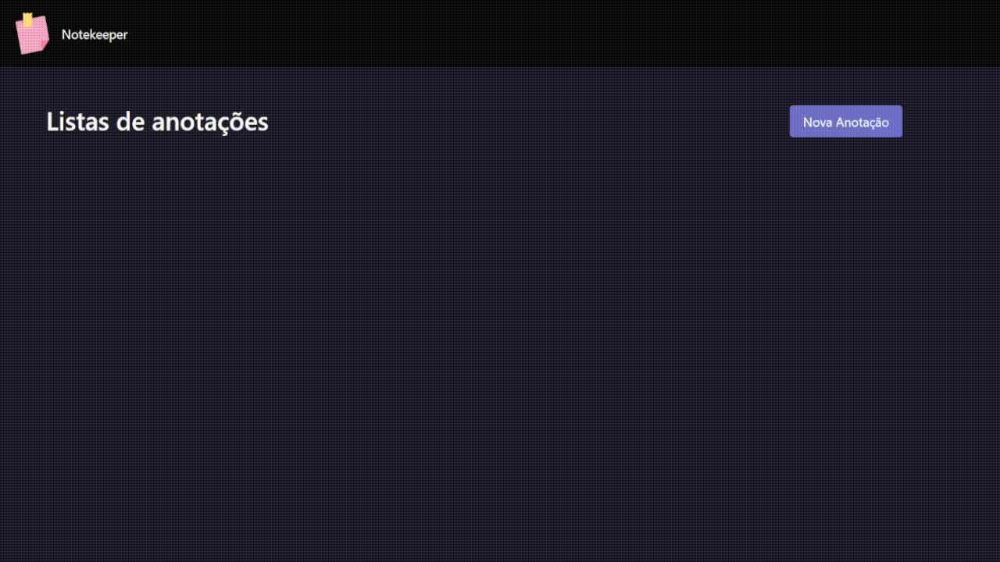

# Notekeeper

## Descrição

Este é um projeto de uma aplicação de notas no estilo post-it, onde o usuário pode armazenar diversas notas pessoais, além de apagá-las e atualizá-las. 
Foi utilizado Node, Express, MongoDB, Mongoose, EJS e MethodOverride.

---
## Prévia

---
## Como instalar e utilizar

Após clonar o repositório, instale as dependências com `npm install`.
Para iniciar o servidor local com o nodemon, utilize o comando `npm run server`. 

Para funcionar corretamente o banco de dados, você precisa ter instalado o `MongoDB`. Deve-se criar um DB com o nome de `notekeeper` e uma Collection com o nome `notes`.